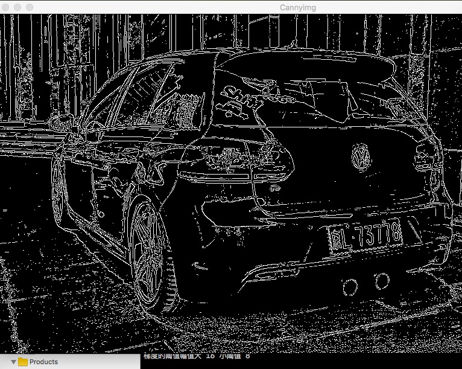
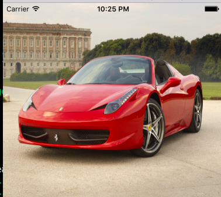
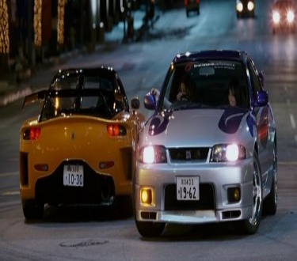
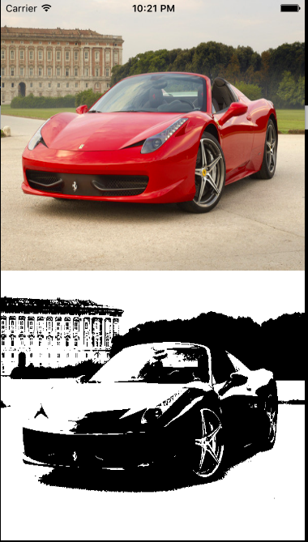
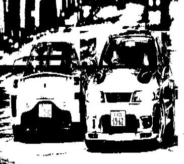
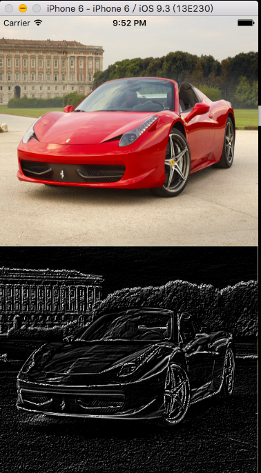
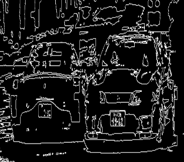
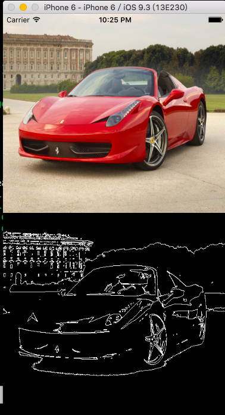
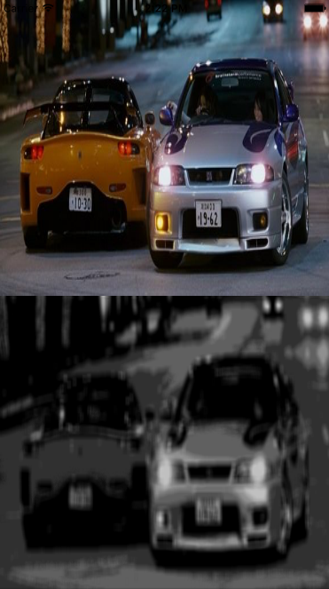
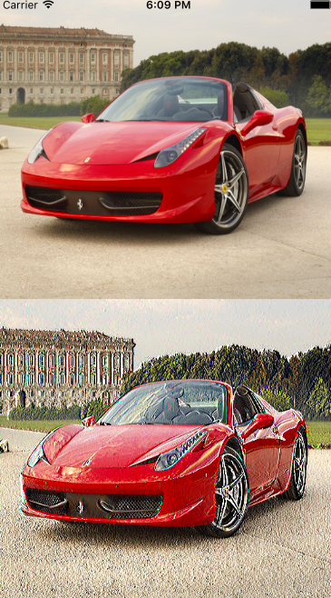

#<a href="#user-content-pic" >C-PhotoDeal_framework</a>    
* 更新  
    * 2016/10/13,全部移植到OpenCV窗口平台，借用OpenCV窗口输出图像，重写Pixels像素文件，保留老iOSDemo的像素文件
    * 2016/10/12,更新Canny算法实现，位于C-PhotoDeal_framework/CV-Door/CannyPhoto.hpp文件，构造方法实现，除了之前的算法，目前逐渐新算法实例在C-PhotoDeal_Level2_APP项目中，全部为C++，以OpenCV窗口展示，不再以iOS展示
    * 2016/09/10,更新sobel算子、中值滤波
    * 2016/03/25,更新OTSU算法 
       
* Email：porschegt23@foxmail.com || numberwolf11@gmail.com       
* Github:https://github.com/numberwolf       
* APACHE 2.0 LICENSE       
* Copyright [2016] [Chang Yanlong]                     
http://www.apache.org/licenses/LICENSE-2.0     

<a href="#user-content-pic">查看效果图</a>          
####类库在C-PhotoDeal_framework目录下，Android或者iOS或者Windows都可以兼用，C++原生  
* C-PhotoDeal_framework(RGB8888)    
    * CV-Door/CannyPhoto.hpp Canny检测算法实现过程
        * 构造方法，参数图片路径实现，OpenCV窗口展示
    * Pixels.hpp 图像数据结构      
        * Pixels 载入图像
        * getRed 该点红色通道
        * getGreen 该点绿色通道
        * getBlue 该点蓝色通道
        * getAlpha 该点透明度通道
        * rgbMake 改变图像通道值
        * GrayPixels 灰度化

    * Common.hpp 共用数据结构    
        * GetAverage 平均值
        * GetVariance 方差
        * GetStandard 标准差

    * BlurPhoto.hpp 为锐化、模糊算法       
        * GaussDeal 高斯模糊
        * PointyDeal 基础锐化

    * BinaryzationPhoto 二值化和边缘算法       
        * binaryzation 区域二值化
        * binaryCanny 边缘检测

    * numberPhoto.hpp 为滤镜入口       
        * void static method_zero 输出原图
        * void static method_one 模糊图
        * void static method_two 二值化 / 边缘检测
        * void static method_three 锐化图像
        * void static otsuBinary OTSU算法 ---- 2016/03/25更新
        * void static sobelCanny sobel算子 ---- 2016/09/10更新

    * CannyPhoto.hpp 非二值化加成边缘检测算法
        * sobelCanny sobel算子边缘检测算法

    * removeNoisePhoto.hpp 滤波处理
        * mid_remove 中值滤波

                  
                  
###
效果图:
                
 | 
-----|------ 
 |                                  
 |           
 |             
 |               
 |                

